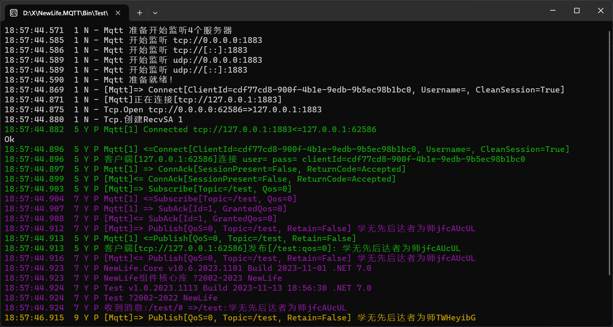

# NewLife.MQTT - 纯国产 MQTT 协议完整实现


**NewLife.MQTT** 是一个**纯国产自主研发、零第三方依赖、MIT 开源**的 MQTT 完整协议实现，同时包含客户端 `MqttClient` 和服务端 `MqttServer`，以单一 NuGet 包形式交付。

## 核心特点

| 特点 | 说明 |
|------|------|
| 🚀 **协议完整** | MQTT 3.1.1 全面支持（14种报文）+ MQTT 5.0 核心功能完整（30种属性） |
| 🔒 **零依赖** | 仅依赖 NewLife.Core 基础库，无供应链安全风险，无许可证冲突 |
| ⚖️ **MIT 开源** | 最宽松的开源协议，可自由修改商用，无 copyleft 限制，无专利条款，无法律风险 |
| 🎯 **客户端+服务端一体** | 单一 `NewLife.MQTT` NuGet 包同时提供客户端和服务端，极简集成 |
| 🌐 **六种传输协议** | TCP / TLS / WebSocket / WSS / QUIC(.NET 7+) / 可靠UDP，业界覆盖面最广 |
| 🏢 **企业功能免费** | 集群/桥接/规则引擎/WebHook/统计/$SYS，竞品需企业版或付费插件 |
| 🇨🇳 **纯国产自主** | 完全自主知识产权，无外部依赖法律风险，信创合规 |
| 🔧 **全版本覆盖** | .NET Framework 4.5 / 4.6.1 / .NET Standard 2.0/2.1 / .NET 7/8/9/10 |

## 差异化优势

### 1. MQTT over QUIC（业界罕见）
- **仅 EMQX 和 NewLife.MQTT 支持**
- 低延迟、无队头阻塞
- .NET 7+ 平台可用（.NET 7/8 需启用预览特性，.NET 9+ 为稳定版本）

### 2. MQTT over 可靠 UDP（独创自研）
- **业界独有**
- 4字节帧头 + 序列号 + Ack确认 + 超时重发
- 无需操作系统 QUIC/msquic 支持，全平台可用

### 3. 企业功能内置免费
- **消息桥接（双向）：** 支持 In/Out/Both 三种方向，主题前缀映射，QoS 上限控制
- **规则引擎（5种动作）：** Republish / WebHook / Bridge / Drop / Custom
- **WebHook 事件推送：** 6种事件，异步非阻塞，支持重试
- **集群支持：** 手动配置节点，跨节点订阅同步与消息转发
- **ProxyProtocol：** 支持 nginx/HAProxy 代理协议 v1/v2，透传真实客户端 IP
- **$SYS 系统主题：** 14种标准主题，实时运行统计

### 4. 重连后自动重订阅
竞品（MQTTnet / Eclipse Paho）断线重连后需要用户**手动重新订阅**，NewLife.MQTT **自动完成**。

### 5. 阿里云 IoT 内置适配
`AliyunMqttClient` 开箱即用，HMAC 签名认证 + 属性上报 + 时钟同步。

## MQTT 协议
最流行的物联网通信协议MQTT，包括客户端、服务端和Web管理平台。  

提供订阅/发布模式，更为简约、轻量，易于使用，针对受限环境（带宽低、网络延迟高、网络通信不稳定），可以简单概括为物联网打造，官方总结特点如下：  
1. 使用发布/订阅消息模式，提供一对多的消息发布，解除应用程序耦合。  
2. 对负载内容屏蔽的消息传输。  
3. 使用 TCP/IP 提供网络连接。  
4. 有三种消息发布服务质量：  
“至多一次”，消息发布完全依赖底层 TCP/IP 网络。会发生消息丢失或重复。这一级别可用于如下情况，环境传感器数据，丢失一次读记录无所谓，因为不久后还会有第二次发送。  
“至少一次”，确保消息到达，但消息重复可能会发生。  
“只有一次”，确保消息到达一次。这一级别可用于如下情况，在计费系统中，消息重复或丢失会导致不正确的结果。  
5. 小型传输，开销很小（固定长度的头部是 2 字节），协议交换最小化，以降低网络流量。  
6. 使用 Last Will 和 Testament 特性通知有关各方客户端异常中断的机制。  

## MQTT 发布与订阅
发布时，指定消息Qos，broker保存的消息包含了Qos；  
订阅时，指定这次订阅要求的Qos，broker回复授权使用的Qos，一般就是申请那个；  
消费时，消息的Qos取发布订阅中较小者！  

详细场景：  
- 订阅Qos=0，不管发布什么消息，消费到的消息Qos都是0；  
- 订阅Qos=1，发布消息Qos=0时，消费得到Qos=0，发布消息Qos=1或2时，消费得到Qos=1；  
- 订阅Qos=2，消费得到的消息Qos，就是发布时的Qos；  
- 发布Qos=0，broker不做任何答复，理论上中途丢了都不知道，但是因为Tcp，如果网络异常客户端能发现；  
- 发布Qos=1，broker答复`PubAck`，表示已经收到消息；  
- 发布Qos=2，broker答复`PubRec`，客户端再次发送`PubRel`，broker答复`PubComp`，消息才算发布完成；
- 订阅Qos=2，broker推送Qos=2消息，客户端先回`PubRec`，broker再次发送`PubRel`，客户端答复`PubComp`，消息才算消费完成；  
- 发布Qos=2消息时，双重确认流程不需要等消费端在线，仅限于发布者与broker之间即可完成。  

## 快速尝鲜
打开源码解决方案，把Test设为启动项目，启动即可。  
默认先后启动TestServer和TestClient。  
  

## 服务端
Nuget引用`NewLife.MQTT`，使用以下代码启动服务端：
```csharp
var services = ObjectContainer.Current;
services.AddSingleton<ILog>(XTrace.Log);
services.AddTransient<IMqttHandler, MqttHandler>();
services.AddSingleton<MqttExchange, MqttExchange>();

var server = new MqttServer
{
    Port = 1883,
    ServiceProvider = services.BuildServiceProvider(),

    Log = XTrace.Log,
    SessionLog = XTrace.Log,
};
server.Start();
```
通过指定端口1883，默认处理器`MqttHandler`，默认交换机`MqttExchange`，启动服务端。  

## 客户端
Nuget引用`NewLife.MQTT`，使用以下代码连接服务端：
```csharp
var client = new MqttClient
{
    Log = XTrace.Log,
    Server = "tcp://127.0.0.1:1883",
    //UserName = "admin",
    //Password = "admin",
    ClientId = Guid.NewGuid() + "",
};

await client.ConnectAsync().ConfigureAwait(false);

// 订阅“/test”主题
var rt = await client.SubscribeAsync("/test", (e) =>
{
    XTrace.WriteLine("收到消息:" + "/test/# =>" + e.Topic + ":" + e.Payload.ToStr());
}).ConfigureAwait(false);

// 每2秒向“/test”主题发布一条消息
while (true)
{
    try
    {
        var msg = "学无先后达者为师" + Rand.NextString(8);
        await client.PublishAsync("/test", msg).ConfigureAwait(false);
    }
    catch (Exception ex)
    {
        XTrace.WriteException(ex);
    }
    await Task.Delay(2000).ConfigureAwait(false);
}
```
客户端连接服务端有几个要素：`服务端地址`、`用户名`、`密码`、`客户端标识`，然后通过`ConnectAsync`连接服务端。  
客户端可以是消费者角色，通过`SubscribeAsync`订阅指定Topic。  
客户端也可以是生产者角色，通过`PublishAsync`发布消息到指定Topic。

## 共享订阅（EMQX）
支持EMQX共享订阅功能，多个客户端可以订阅同一个共享主题，MQTT代理会将消息负载均衡地分发给订阅者。  
共享订阅的格式为：`$share/{group}/{topic}`，其中`{group}`是共享组名，`{topic}`是实际的主题过滤器。

```csharp
// 订阅共享主题，多个客户端订阅同一个共享组，消息会被负载均衡
await client.SubscribeAsync("$share/group1/Yh/Drive/+/OrderLock", (e) =>
{
    XTrace.WriteLine($"收到共享订阅消息: {e.Topic} => {e.Payload.ToStr()}");
}).ConfigureAwait(false);

// 发布消息到实际主题（不包含$share前缀）
await client.PublishAsync("Yh/Drive/1111/OrderLock", "订单锁定").ConfigureAwait(false);
```

共享订阅的优势：
- **负载均衡**：同一共享组内的多个订阅者会均衡接收消息
- **水平扩展**：可以通过增加订阅者来提高消息处理能力
- **高可用性**：某个订阅者故障时， 其他订阅者仍可继续处理消息  

### 指定MQTT协议版本
从2.3.2025.0212版本开始，客户端支持指定MQTT协议版本。可以通过`Version`属性设置协议版本，支持MQTT 3.1、3.1.1和5.0：
```csharp
var client = new MqttClient
{
    Log = XTrace.Log,
    Server = "tcp://127.0.0.1:1883",
    ClientId = Guid.NewGuid() + "",
    Version = MqttVersion.V500, // 指定MQTT 5.0版本
};
```
支持的版本有：
- `MqttVersion.V310` - MQTT 3.1
- `MqttVersion.V311` - MQTT 3.1.1（默认）
- `MqttVersion.V500` - MQTT 5.0

**注意**：如果不显式设置`Version`属性，客户端默认使用MQTT 3.1.1版本，保持向后兼容。

## 自定义服务端
需要在服务端处理客户端连接和消息交互逻辑时，就需要自定义服务端。例如IoT平台，在收到设备上报MQTT数据以后，直接接收落库，而不需要再次消费。  
自定义处理器示例如下：
```csharp
private class MyHandler : MqttHandler
{
    private readonly ILog _log;

    public MyHandler(ILog log) => _log = log;

    protected override ConnAck OnConnect(ConnectMessage message)
    {
        _log.Info("客户端[{0}]连接 user={1} pass={2} clientId={3}", Session.Remote.EndPoint, message.Username, message.Password, message.ClientId);

        return base.OnConnect(message);
    }

    protected override MqttMessage OnDisconnect(DisconnectMessage message)
    {
        _log.Info("客户端[{0}]断开", Session.Remote);

        return base.OnDisconnect(message);
    }

    protected override MqttIdMessage OnPublish(PublishMessage message)
    {
        _log.Info("客户端[{0}]发布[{1}:qos={2}]: {3}", Session.Remote, message.Topic, (Int32)message.QoS, message.Payload.ToStr());

        return base.OnPublish(message);
    }
}
```
稍微修改一下服务端注入处理器的代码即可使用自定义处理器：
```csharp
var services = ObjectContainer.Current;
services.AddSingleton<ILog>(XTrace.Log);
services.AddTransient<IMqttHandler, MyHandler>();
services.AddSingleton<MqttExchange, MqttExchange>();

var server = new MqttServer
{
    Port = 1883,
    ServiceProvider = services.BuildServiceProvider(),

    Log = XTrace.Log,
    SessionLog = XTrace.Log,
};
server.Start();
```

## 集群
集群管理，Join、Ping、Lease。  
Join加入集群，告诉对方我是集群节点之一，启动时调用N-1次。  
每15秒Ping一次所有节点，更新活跃时间。  
Lease离开集群，调用N-1次。  
每个节点根据最后活跃时间，定时剔除超时节点。  

## 新生命项目矩阵
各项目默认支持net9.0/netstandard2.1/netstandard2.0/net4.62/net4.5，旧版（2024.0801）支持net4.0/net2.0  

|                               项目                               | 年份  | 说明                                                                                        |
| :--------------------------------------------------------------: | :---: | ------------------------------------------------------------------------------------------- |
|                             基础组件                             |       | 支撑其它中间件以及产品项目                                                                  |
|          [NewLife.Core](https://github.com/NewLifeX/X)           | 2002  | 核心库，日志、配置、缓存、网络、序列化、APM性能追踪                                         |
|    [NewLife.XCode](https://github.com/NewLifeX/NewLife.XCode)    | 2005  | 大数据中间件，单表百亿级，MySql/SQLite/SqlServer/Oracle/PostgreSql/达梦，自动分表，读写分离 |
|      [NewLife.Net](https://github.com/NewLifeX/NewLife.Net)      | 2005  | 网络库，单机千万级吞吐率（2266万tps），单机百万级连接（400万Tcp长连接）                     |
| [NewLife.Remoting](https://github.com/NewLifeX/NewLife.Remoting) | 2011  | 协议通信库，提供CS应用通信框架，支持Http/RPC通信框架，高吞吐，物联网设备低开销易接入        |
|     [NewLife.Cube](https://github.com/NewLifeX/NewLife.Cube)     | 2010  | 魔方快速开发平台，集成了用户权限、SSO登录、OAuth服务端等，单表100亿级项目验证               |
|    [NewLife.Agent](https://github.com/NewLifeX/NewLife.Agent)    | 2008  | 服务管理组件，把应用安装成为操作系统守护进程，Windows服务、Linux的Systemd                   |
|     [NewLife.Zero](https://github.com/NewLifeX/NewLife.Zero)     | 2020  | Zero零代脚手架，基于NewLife组件生态的项目模板NewLife.Templates，Web、WebApi、Service        |
|                              中间件                              |       | 对接知名中间件平台                                                                          |
|    [NewLife.Redis](https://github.com/NewLifeX/NewLife.Redis)    | 2017  | Redis客户端，微秒级延迟，百万级吞吐，丰富的消息队列，百亿级数据量项目验证                   |
| [NewLife.RocketMQ](https://github.com/NewLifeX/NewLife.RocketMQ) | 2018  | RocketMQ纯托管客户端，支持Apache RocketMQ和阿里云消息队列，十亿级项目验                     |
|     [NewLife.MQTT](https://github.com/NewLifeX/NewLife.MQTT)     | 2019  | 物联网消息协议，MqttClient/MqttServer，客户端支持阿里云物联网                               |
|      [NewLife.IoT](https://github.com/NewLifeX/NewLife.IoT)      | 2022  | IoT标准库，定义物联网领域的各种通信协议标准规范                                             |
|   [NewLife.Modbus](https://github.com/NewLifeX/NewLife.Modbus)   | 2022  | ModbusTcp/ModbusRTU/ModbusASCII，基于IoT标准库实现，支持ZeroIoT平台和IoTEdge网关            |
|  [NewLife.Siemens](https://github.com/NewLifeX/NewLife.Siemens)  | 2022  | 西门子PLC协议，基于IoT标准库实现，支持IoT平台和IoTEdge                                      |
|      [NewLife.Map](https://github.com/NewLifeX/NewLife.Map)      | 2022  | 地图组件库，封装百度地图、高德地图、腾讯地图、天地图                                        |
|    [NewLife.Audio](https://github.com/NewLifeX/NewLife.Audio)    | 2023  | 音频编解码库，PCM/ADPCMA/G711A/G722U/WAV/AAC                                                |
|                             产品平台                             |       | 产品平台级，编译部署即用，个性化自定义                                                      |
|         [Stardust](https://github.com/NewLifeX/Stardust)         | 2018  | 星尘，分布式服务平台，节点管理、APM监控中心、配置中心、注册中心、发布中心                   |
|           [AntJob](https://github.com/NewLifeX/AntJob)           | 2019  | 蚂蚁调度，分布式大数据计算平台（实时/离线），蚂蚁搬家分片思想，万亿级数据量项目验证         |
|      [NewLife.ERP](https://github.com/NewLifeX/NewLife.ERP)      | 2021  | 企业ERP，产品管理、客户管理、销售管理、供应商管理                                           |
|         [CrazyCoder](https://github.com/NewLifeX/XCoder)         | 2006  | 码神工具，众多开发者工具，网络、串口、加解密、正则表达式、Modbus、MQTT                      |
|           [EasyIO](https://github.com/NewLifeX/EasyIO)           | 2023  | 简易文件存储，支持分布式系统中文件集中存储。                                                |
|           [XProxy](https://github.com/NewLifeX/XProxy)           | 2005  | 产品级反向代理，NAT代理、Http代理                                                           |
|        [HttpMeter](https://github.com/NewLifeX/HttpMeter)        | 2022  | Http压力测试工具                                                                            |
|         [GitCandy](https://github.com/NewLifeX/GitCandy)         | 2015  | Git源代码管理系统                                                                           |
|          [SmartOS](https://github.com/NewLifeX/SmartOS)          | 2014  | 嵌入式操作系统，完全独立自主，支持ARM Cortex-M芯片架构                                      |
|          [SmartA2](https://github.com/NewLifeX/SmartA2)          | 2019  | 嵌入式工业计算机，物联网边缘网关，高性能.NET8主机，应用于工业、农业、交通、医疗             |
|                          FIoT物联网平台                          | 2020  | 物联网整体解决方案，建筑、环保、农业，软硬件及大数据分析一体化，单机十万级点位项目验证      |
|                        UWB高精度室内定位                         | 2020  | 厘米级（10~20cm）高精度室内定位，软硬件一体化，与其它系统联动，大型展厅项目验证             |


## 新生命开发团队
  

新生命团队（NewLife）成立于2002年，是新时代物联网行业解决方案提供者，致力于提供软硬件应用方案咨询、系统架构规划与开发服务。  
团队主导的80多个开源项目已被广泛应用于各行业，Nuget累计下载量高达400余万次。  
团队开发的大数据中间件NewLife.XCode、蚂蚁调度计算平台AntJob、星尘分布式平台Stardust、缓存队列组件NewLife.Redis以及物联网平台FIoT，均成功应用于电力、高校、互联网、电信、交通、物流、工控、医疗、文博等行业，为客户提供了大量先进、可靠、安全、高质量、易扩展的产品和系统集成服务。  

我们将不断通过服务的持续改进，成为客户长期信赖的合作伙伴，通过不断的创新和发展，成为国内优秀的IoT服务供应商。  

`新生命团队始于2002年，部分开源项目具有20年以上漫长历史，源码库保留有2010年以来所有修改记录`  
网站：https://newlifex.com  
开源：https://github.com/newlifex  
QQ群：1600800/1600838  
微信公众号：  
  
